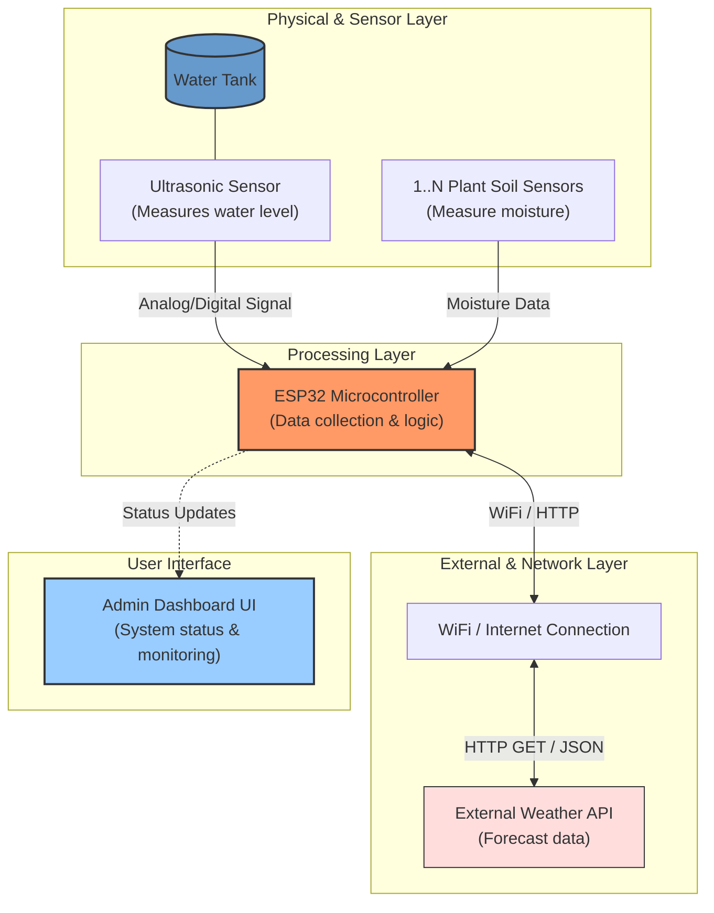

# Watermanagement

## Simple Component Diagram

```mermaid
flowchart TB
    %% Physical layer (Sensors & Water Source)
    subgraph Physical_Layer [Physical & Sensor Layer]
        WaterTank[(Water Tank)]
        UltrasonicSensor["Ultrasonic Sensor\n(Measures water level)"]
        PlantSensors["1..N Plant Soil Sensors\n(Measure moisture)"]
    end

    %% Edge computing (ESP32)
    subgraph Edge_Layer [Processing Layer]
        ESP32["ESP32 Microcontroller\n(Data collection & logic)"]
    end

    %% External services and connections
    subgraph External_Services [External & Network Layer]
        WiFi[WiFi / Internet Connection]
        WeatherAPI["External Weather API\n(Forecast data)"]
    end

    %% Presentation / Admin
    subgraph Presentation_Layer [User Interface]
        AdminDashboard["Admin Dashboard UI\n(System status & monitoring)"]
    end

    %% Connections and Data Flow
    WaterTank --- UltrasonicSensor
    UltrasonicSensor -->|Analog/Digital Signal| ESP32
    PlantSensors -->|Moisture Data| ESP32

    ESP32 <-->|WiFi / HTTP| WiFi
    WiFi <-->|HTTP GET / JSON| WeatherAPI
    
    ESP32 -.->|Status Updates| AdminDashboard

    %% Styling for better visual separation
    style ESP32 fill:#f96,stroke:#333,stroke-width:2px
    style AdminDashboard fill:#9cf,stroke:#333,stroke-width:2px
    style WaterTank fill:#69c,stroke:#333,stroke-width:2px
    style WeatherAPI fill:#fdd,stroke:#333,stroke-width:1px
```

